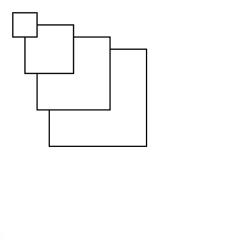
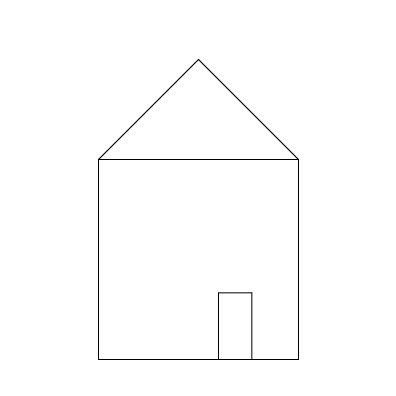
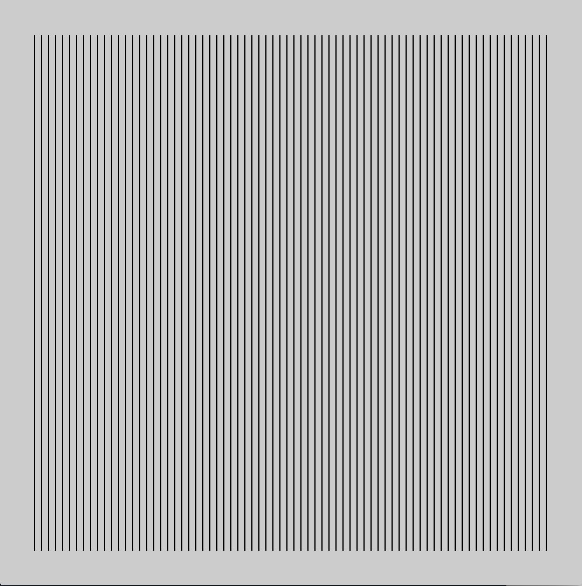
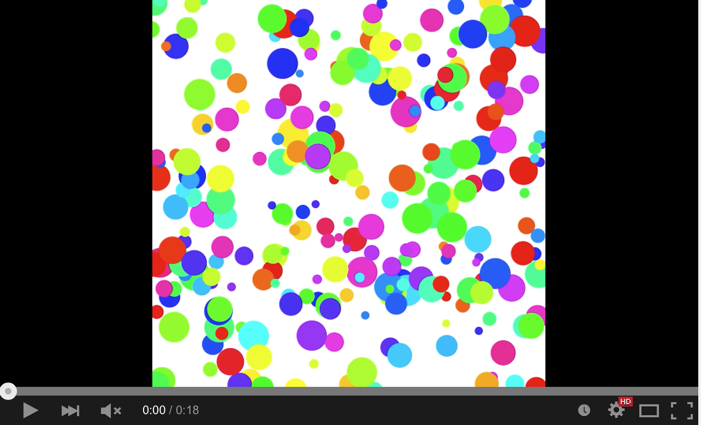

# CCA Programming & Electronics, Fall 2016, Monday section

This course repository contains homework assignments, useful guides, and code for "Programming & Electronics" at CCA, Fall 2016, Monday section.

Also included in this repository is the official [course syllabus](syllabus.pdf).

### Week 1: Monday, September 12, 2016

Lecture:
- Inspirational Videos
- Introductions
- What is programming?
- Goals & course details

Hands-on activities:
- Human Embodiment of Programmer & Robot
  - Programs generally run line-by-line.
  - While loops, if statements, and functions break that up.

Some inspirational videos:
- Basic robots
  - [Coffee-can robot](http://www.youtube.com/watch?v=b0mIshBIbvI#t=24)
  - [Tree-climbing robot](http://www.youtube.com/watch?v=zkpH1BjD6Wc)
  - [Self-balancing robot](http://www.youtube.com/watch?v=Tw9Jr-SPL0Y)
  - [Insect robot](http://www.youtube.com/watch?v=tOsNXg2vAd4#t=120)
  - [Treadbot](http://www.youtube.com/watch?v=YblSltHDbIU)
  - [Velociraptor robot](http://www.youtube.com/watch?v=lPEg83vF_Tw)
- Installations
  - [The Bay Lights](http://thebaylights.org/)
  - [Murmur Wall](http://www.future-cities-lab.net/projects/#/murmurwall/)
  - [Floating Couch](http://vimeo.com/72826106)
  - [Wooden Segment Mirror](https://www.youtube.com/watch?v=BZysu9QcceM#t=36)
  - [Generative design](https://www.youtube.com/watch?v=pNkz8wEJljc)
- Art & Music bots
  - [Textile weaving](https://vimeo.com/71044541)
  - [ReacTable](https://www.youtube.com/user/marcosalonso)
  - [Projection mapping](https://www.youtube.com/watch?v=czuhNcNU6qU)
  - [Laser harp](http://www.youtube.com/watch?v=sLVXmsbVwUs#t=20)
  - [Cubli: Floating Cube](https://www.youtube.com/watch?v=n_6p-1J551Y)
  - [Arc-o-matic](http://vimeo.com/57082262#at=130)
  - [Robo Faber](http://vimeo.com/78771257)
  - [Eggbot](https://www.youtube.com/watch?v=w4cdbV2oaEc)
- Drink-makers
  - [Textspresso](http://www.youtube.com/watch?v=kx9D74t7GD8#t=89)
  - [The Inebriator](http://www.youtube.com/watch?v=WqY7fchs7H0)
- Computer Numerical Control (CNC)
  - [Shapoko / tinyg](http://www.youtube.com/watch?v=pCC1GXnYfFI#t=11)
  - [Makerbot Replicator](http://www.youtube.com/watch?v=NAbiAzYhTOQ)
- Vacuuming
  - [Roomba](https://www.youtube.com/watch?v=0DNkbZvVYvc)

[Homework for Week 1](hw/week1.md)

### Week 2: Monday, September 19, 2016

Lecture:
- Homework Review

Workshop:

Together, we'll write code to generate this image:



Lab:
#### Sketching with P5.js

1.  Rewrite the following code without using a loop:

    ```javascript
    function setup() {
      createCanvas(200, 200);
      background(255);

      var i = 0;
      while (i < 7) {
        line(10+i*30, 10, 10+i*30, height-10);
        i = i + 1;
      }    
    }
    ```

2.  Rewrite the following code using a `while` or `for` loop:

    ```javascript
    function setup() {
      createCanvas(200, 200);
      background(255);

      line(10, 10, 20, 10);
      line(20, 20, 30, 20);
      line(30, 30, 40, 30);
      line(40, 40, 50, 40);
      line(50, 50, 60, 50);
      line(60, 60, 70, 60);
      line(70, 70, 80, 70);
      line(80, 80, 90, 80);
      line(90, 90, 100, 90);
      line(100, 100, 110, 100);
      line(110, 110, 120, 110);
      line(120, 120, 130, 120);
      line(130, 130, 140, 130);
      line(140, 140, 150, 140);
      line(150, 150, 160, 150);
      line(160, 160, 170, 160);
      line(170, 170, 180, 170);
      line(180, 180, 190, 180);
    }
    ```

#### Recreating Sketches

1. 

2. 

3. 

4. 

5. [](http://www.youtube.com/watch?v=jWNXFlGHuPA)

6. 

6. Look through the [P5js reference](http://p5js.org/reference/). Pick a function, and use it in a new sketch of your own choosing.

[Homework for Week 2](hw/week2.md)

### Week 3: Monday, September 26, 2016

In class:

- Homework review

- Loops review

In class, we reviewed one way of thinking about how to create a loop. We developed the following process:

1. Write down the coordinates of the shapes you want to create in your loop.
2. Find the pattern for those coordinates
  a. Where does it start?
  b. Where does it end?
  c. How much does it change each time?
  
For example, to create the following sketch:


...start by writing down some endpoints for those lines:

```
(20, 20) -> (20, 20)
(20, 30) -> (30, 20)
(20, 40) -> (40, 20)
(20, 50) -> (50, 20)
(20, 60) -> (60, 20)
(20, 70) -> (70, 20)
(20, 80) -> (80, 20)
.
.
.
(20, 480) -> (480, 20)
```

...from these coordinates, we can find a pattern for each of the four parameters we need to draw a line:

- `startX`: always 20
- `startY`: starts at 20, ends at 480, goes up by 10 each time
- `endX`: starts at 20, ends at 480, goes up by 10 each time
- `endY`: always 20

...from this pattern, we can generate a loop that draws these lines, by creating a variable that starts at `20`, ends at `480`, and goes up by `10` each time. We won't call the variable `x` or `y` beacuse we don't use it exclusively for either coordinate.

```javascript
for (var i = 20; i <= 480; i = i + 10) {
  var startX = 20;
  var startY = i;
  var endX = i;
  var endY = 20;
  line(startX, startY, endX, endY);
}
```

You'll explore a few more similar puzzles in the homework!

[Homework for Week 3](hw/week3.md)

### Week 4: Monday, October 3, 2016

In class:

- Homework review

We reviewed the process we developed last week for thinking about a loop.

- Arduino

We installed the Arduino software, attached Arduino boards, and uploaded a
program to blink the built in LED. We changed the speed of the blink by
changing the parameter in the delay() function.

- Servo motors

We attached a servo motor to the Arduino and made the arm move back and forth
using the "sweep" example.

[Homework for Week 4](hw/week4.md)

### Week 5: Monday, October 10, 2016

In class:

- Homework review

We reviewed your questions about Arduino and electronics.

- Arduino

We tested our setup with the "blink" example, and then we connected a servo
motor. First we used
the "sweep" example to move the servo motor, and then we learned how to use a
potentiometer and the "knob" example to control the position of the servo
motor with the potentiometer.

[Homework for Week 5](hw/week5.md)

### Week 6: Monday, October 17, 2016

In class:

- Homework review
- Practice with sensors
   - Learning about LDRs and voltage dividers
   - Using an LDR to control a servo.
- Lab time

[Homework for Week 6](hw/week6.md)

### Week 7: Monday, October 24, 2016

In class:

- Practice quiz review
- Lab time

[Homework for Week 7](hw/week7.md)


### Week 8: Monday, October 31, 2016

In class:

- Practice quiz review
- Skulls project critique

[Homework for Week 8](hw/week8.md)


### Week 9: Monday, November 7, 2016

In class:

- Quiz!

#### Final Project

Prepare a proposal for your final project.

Create a new github repository for your project, and modify the README.md file to include **these four sections**, each of which should have a heading and a description. (To learn about formatting text in markdown `.md` files, read [this tutorial](https://help.github.com/articles/markdown-basics/).)

You can find a template [here](project-template.md).

Your proposal should be thoughtful, complete, and should take into consideration the feedback you received from us and your classmates. You can always modify what you're doing later on, but your proposal should describe a complete project.

The final project is your opportunity to put to work what you've learned so far in class, and to build the skills you're most interested in taking forward with you into your career. *Each assignment is in the project sequence is required, so put in the time to ensure that each is complete and well-considered!*